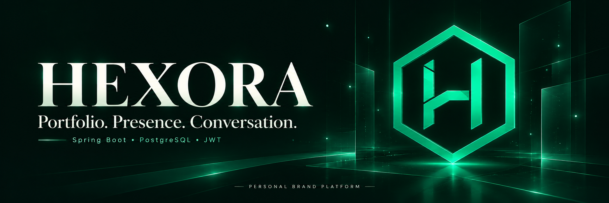
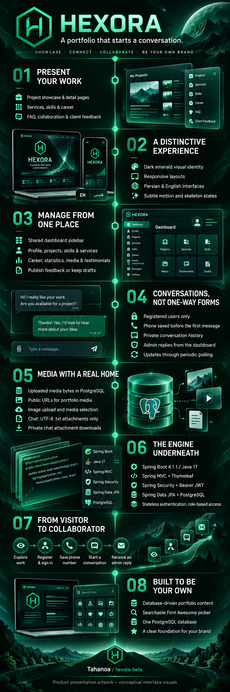
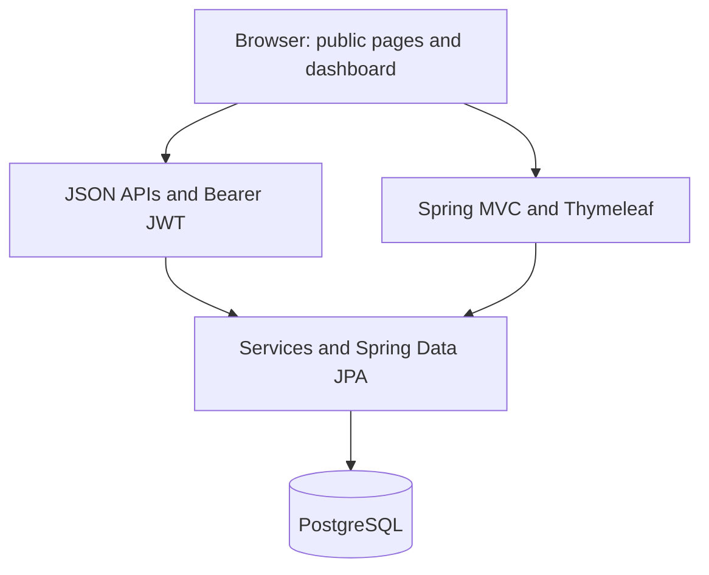

<p align="center">
  
</p>

<h1 align="center">Hexora</h1>
<p align="center"><strong>A portfolio that starts a conversation.</strong><br>Show your work. Manage your presence. Turn interest into collaboration.</p>
<p align="center">
  
  
  
  
  
</p>
<p align="center"><a href="#the-experience">Experience</a> · <a href="#project-overview">Infographic</a> · <a href="#quick-start">Quick start</a> · <a href="#routes">Routes</a> · <a href="#architecture">Architecture</a></p>

<div dir="rtl">

**Hexora یک وب‌سایت شخصی با مدیریت محتوا و گفت‌وگوی مستقیم با کارفرماست.** نمونه‌کارها، مهارت‌ها، خدمات و مسیر حرفه‌ای را از دیتابیس نمایش می‌دهد؛ ادمین محتوا و پاسخ‌ها را در داشبورد مدیریت می‌کند. کاربران پس از ثبت‌نام و ذخیره شماره تماس، گفت‌وگوی خصوصی خود را آغاز می‌کنند. تم تیره و سبز، حرکت‌های آرام و رابط‌های فارسی و انگلیسی، هویت بصری پروژه را شکل می‌دهند.

</div>

## The experience

Hexora connects three parts of a personal brand: the work people discover, the content you maintain, and the conversations that follow. Portfolio content lives in PostgreSQL. The dashboard manages it. Visitors can explore public pages, then register to discuss a project in a private chat.

### Discover the work

- **Project showcase and detail pages:** titles, descriptions, images, project dates, client names, status, demo links and source links. Empty optional fields disappear from the presentation.
- **Services and skills:** database-driven content, separate public pages and a restrained homepage preview. Skill icons drift slowly on the homepage; the about page groups skills by category.
- **About and career:** profile content, circular portrait, floating skill icons, work history and counts derived from portfolio data.
- **Collaboration:** an alternating timeline that explains the path from discovery to handover.
- **FAQ:** keyboard-accessible questions with animated opening and closing.
- **Client feedback:** published testimonials with optional company, role, project, image, rating and source. Longer homepage quotes have a read-more control. No fabricated endorsements are seeded.
- **Custom 404:** an emerald-themed recovery page returned with HTTP status 404.

### Maintain one coherent dashboard

A shared sidebar ties together profile, projects, services, skills, career, statistics, media, client feedback and conversations.

| Area | What you can manage |
| --- | --- |
| Profile | Identity, biography, social links, contact details, collaboration status and portrait |
| Projects | Create, edit and delete projects; upload an image or choose existing media |
| Skills | Categories, levels, descriptions and searchable Font Awesome icons |
| Services / career / statistics | Portfolio content through the corresponding backend APIs |
| Media | Upload, inspect, replace, copy a public URL and delete uploaded files |
| Testimonials | Actual feedback, optional metadata, display order and draft/published state |
| Conversations | User threads, phone numbers, message history, replies and text attachments |

### Continue the conversation

1. The visitor registers and signs in.
2. The user saves a phone number on their account, in the `users` table.
3. The server checks the saved phone number before accepting a message or attachment.
4. The user sends text or a UTF-8 `.txt` file.
5. The administrator replies from `/manage/contact`; the user follows the reply in `/contact`.

Each user accesses their own thread. Administrative conversation endpoints require the `ADMIN` role. Updates use **periodic polling every five seconds**, rather than WebSockets. History supports cursor-based retrieval in batches of up to 100 messages.

| Upload type | Storage and access |
| --- | --- |
| Portfolio media | Bytes stored in PostgreSQL; public file URLs under `/api/media/public/{id}` |
| Project images | PNG, JPEG, GIF or WebP; upload directly or select from the media library |
| Chat attachments | UTF-8 `.txt` only; bytes stored in PostgreSQL; downloads restricted to the thread owner and administrators |

General media uploads have a 5 MB limit. Chat text is limited to 4,000 characters; chat files must also fit within 16,000 bytes and the text-length limit. Uploaded file content is checked on the server.

## Project overview

<p align="center">
  <a href="docs/assets/hexora-infographic.png"></a>
</p>

The header and infographic are generated presentation artwork. The interface illustrations are **conceptual visuals, not screenshots** of the running application. [Artwork prompts](docs/image-prompts.md) document the visual brief.

## Architecture



| Layer | Technology |
| --- | --- |
| Runtime | Java 17, Maven Wrapper |
| Application | Spring Boot 4.1.1, Spring MVC |
| Views | Thymeleaf, HTML, CSS and JavaScript; Tailwind in dashboard templates |
| Authentication | Spring Security, signed Bearer JWT, `USER` / `ADMIN` roles |
| Persistence | Spring Data JPA / Hibernate, PostgreSQL |
| Icons | Font Awesome with a searchable catalog |
| Operations | Actuator health endpoint, environment-based configuration |

**PostgreSQL is the only database configured by the application.** Authentication is stateless: APIs receive `Authorization: Bearer <token>`, and the application does not use a login session ID. Browser code stores the access token in local storage. The configurable token lifetime defaults to 900 seconds; logout clears the browser credentials, rather than revoking an already issued token on the server.

## Quick start

### Prerequisites

- Java 17 and a running PostgreSQL database.
- Network access to Maven repositories for the first dependency download.
- Git; the repository includes the Maven Wrapper.

### 1. Clone and prepare the database

```bash
git clone https://github.com/Tahanoa/hexora-beta.git
cd hexora-beta
```

Create a PostgreSQL database with your preferred database tool:

```sql
CREATE DATABASE hexora;
```

### 2. Configure the application

In Bash / Git Bash:

```bash
export DATABASE_URL='jdbc:postgresql://localhost:5432/hexora'
export DATABASE_USERNAME='postgres'
export DATABASE_PASSWORD='your-database-password'
export JWT_SECRET="$(openssl rand -base64 32)"
export ADMIN_USERNAME='hexora-admin'
export ADMIN_EMAIL='admin@example.com'
export ADMIN_PASSWORD='choose-a-strong-admin-password'
```

Use **`openssl rand -base64 32`**, including the `openssl` command. Keep the generated JWT secret in your environment configuration for subsequent runs; changing it invalidates existing tokens. If OpenSSL is unavailable, generate a Base64-encoded random key of at least 32 bytes with another trusted tool.

The `ADMIN_*` variables create an administrator when all three are provided and that username does not already exist. They do not change the password of an existing account. Use your actual email and unique credentials.

### 3. Run

```bash
./mvnw spring-boot:run
```

On Windows Command Prompt or PowerShell, set the equivalent environment variables and run:

```powershell
.\mvnw.cmd spring-boot:run
```

Open **http://localhost:8080/**, sign in at `/login`, and manage content at `/dashboard`. Login returns to the root homepage. `/home` redirects to `/`.

The current development configuration uses `JPA_DDL_AUTO=update` to create or update entity tables, including chat messages and testimonials. Flyway dependencies and its location setting are present, but this repository currently contains **no versioned migration scripts**. Do not assume an existing production migration workflow.

### Configuration reference

| Variable | Purpose | Default / behavior |
| --- | --- | --- |
| `DATABASE_URL` | PostgreSQL JDBC URL | Local `postgres` database in the development configuration |
| `DATABASE_USERNAME` / `DATABASE_PASSWORD` | Database credentials | Explicit values recommended |
| `JWT_SECRET` | JWT signing key | Required; decoded key must contain at least 32 bytes |
| `JWT_ACCESS_TOKEN_TTL` | Access-token lifetime, seconds | `900` |
| `ADMIN_USERNAME` / `ADMIN_EMAIL` / `ADMIN_PASSWORD` | Initial administrator | No administrator is bootstrapped without all three |
| `REGISTRATION_ENABLED` | Permit new account registration | `true` in development; `false` in the `prod` profile unless enabled |
| `JPA_DDL_AUTO` | Hibernate schema behavior | `update` |
| `PORT` | HTTP port | `8080` |
| `JPA_SHOW_SQL` | SQL logging | `false` |

For the `prod` profile, provide the required database variables and signing key. Set `REGISTRATION_ENABLED=true` if visitors should be able to create accounts for chat. Use HTTPS and establish a deliberate schema-management and backup process for your deployment.

## Routes

| Public route | Page |
| --- | --- |
| `/` | Homepage |
| `/projects` / `/projects/{slug}` | Work showcase / project detail |
| `/services` / `/skills` | Services / skills |
| `/about` | About and career; `/experience` redirects here |
| `/collaboration` | Collaboration process |
| `/faq` / `/testimonials` | Questions / published client feedback |
| `/contact` | Chat entry; authentication and a saved phone are required to send |
| `/login` / `/register` | Authentication |

| Dashboard route | Page |
| --- | --- |
| `/dashboard` / `/profile` | Overview / profile management |
| `/manage/projects` / `/manage/skills` / `/manage/services` | Portfolio management |
| `/manage/experience` / `/manage/statistics` | Career / statistics |
| `/manage/media` / `/manage/testimonials` | Media / client feedback |
| `/manage/contact` | Administrative chat |

Dashboard HTML shells are loadable routes; browser code checks the account and the backend enforces administrative access to protected APIs.

### API orientation

| API | Access / purpose |
| --- | --- |
| `/api/auth/register`, `/api/auth/login` | Public authentication entry points |
| `/api/auth/me`, `/api/auth/phone` | Authenticated account information / save phone |
| `/api/{profile,projects,skills,services,experience,statistics}/public…` | Public portfolio reads |
| `/api/testimonials/public` | Published feedback only |
| `/api/media/public/{id}` | Public portfolio file bytes |
| `/api/chat/messages`, `/api/chat/files` | Own thread and text attachments; authentication required |
| `/api/chat/admin/…` | Administrative conversation management |
| Other portfolio management `/api/…` routes | `ADMIN` access |

See the controllers under `src/main/java/dev/hexora/controller` and `security/AuthController.java` for exact methods, request fields and response shapes. The old anonymous contact-form POST is removed; its legacy records are retained.

## Repository map

```text
src/main/java/dev/hexora/
  controller/       HTTP routes and APIs
  dto/              Request and response contracts
  model/            Persistent entities
  repository/       Data access
  security/         Authentication and JWT
  service/          Application behavior
src/main/resources/
  templates/home/   Public portfolio and chat views
  templates/dashboard/  Shared dashboard and administration
  templates/error/  Custom 404
  static/           CSS, JavaScript, fonts, icons and brand assets
docs/assets/        README presentation artwork
```

## Project status

Hexora is a **beta application under active development**. This README describes code present in the repository; it is not a claim of a completed security audit or production certification. Recent JavaScript syntax checks passed, but a full backend build was blocked in the working environment by unavailable Maven repository access. Verify the application against your PostgreSQL instance before deployment.

If the first build reports an unresolved parent POM or a dependency download error, check Maven repository access before changing application code. If startup reports a missing JWT secret, configure `JWT_SECRET`. If chat sending is disabled, sign in and save a phone number through the chat page.

---

Built by [Tahanoa](https://github.com/Tahanoa) · [Hexora repository](https://github.com/Tahanoa/hexora-beta)
