<p align="center">
  
</p>

<h1 align="center">Hexora</h1>
<p align="center"><strong>A portfolio that starts a conversation.</strong><br>Show your work. Manage your presence. Turn interest into collaboration.</p>
<p align="center">
  
  
  
  
  
</p>
<p align="center"><a href="#the-experience">Experience</a> · <a href="#services">Services</a> · <a href="#demo-studio">Demo studio</a> · <a href="#screenshots">Screenshots</a> · <a href="#project-overview">Infographic</a> · <a href="#quick-start">Quick start</a> · <a href="#routes">Routes</a> · <a href="#architecture">Architecture</a> · <a href="#validation">Validation</a></p>

<div dir="rtl">

**Hexora یک وب‌سایت شخصی با مدیریت محتوا و گفت‌وگوی مستقیم با کارفرماست.** نمونه‌کارها، مهارت‌ها، خدمات و مسیر حرفه‌ای را از دیتابیس نمایش می‌دهد؛ ادمین محتوا و پاسخ‌ها را در داشبورد مدیریت می‌کند. خدمات، صفحه جزئیات، کاور، خروجی‌های تحویل و مسیر درخواست دارند. دموساز پنل هم فایل HTML یا ZIP را به دموی قابل پیش‌نمایش و انتشار با لینک عمومی تبدیل می‌کند؛ نسخه‌ها و فایل‌ها در PostgreSQL نگهداری می‌شوند. کاربران پس از ثبت‌نام و ذخیره شماره تماس، گفت‌وگوی خصوصی خود را آغاز می‌کنند. تم تیره و سبز، حرکت‌های آرام و رابط‌های فارسی و انگلیسی، هویت بصری پروژه را شکل می‌دهند.

</div>

## The experience

Hexora connects three parts of a personal brand: the work people discover, the content you maintain, and the conversations that follow. Portfolio content lives in PostgreSQL. The dashboard manages it. Visitors can explore public pages, then register to discuss a project in a private chat.

### Discover the work

- **Project showcase and detail pages:** an alternating case-study layout on `/projects`, with visible descriptions/actions, complete cover images, image enlargement, text search and status filters. Mobile and tablet layouts stack the cover and project information. Details include titles, descriptions, images, project dates, client names, status, demo links and source links; empty optional fields disappear from the presentation. The homepage keeps its compact showcase with desktop hover details and information below the cover on mobile/tablet.
- **Services:** dedicated service catalog and `/services/{slug}` detail pages, full cover images, selected icons, audience, deliverables, scope/exclusions, duration, quote/starting-price/range pricing, support, revisions, related projects and per-service FAQs. The homepage prioritizes featured services. Drafts are excluded from every public service API.
- **Service management:** grouped editor, media upload/picker with preview, editable feature/deliverable lists, project selection, FAQ rows, draft/published state and display order. Publishing requires an introduction and at least one deliverable.
- **Service requests:** a selected service survives sign-in/registration in the same browser tab. The authenticated chat API validates that it is published and saves its title and ID in the first request message. Normal logins still return to `/`.
- **Skills:** database-driven content with dedicated category panels on `/skills`, levels and selected icons. The homepage has a continuous icon/name marquee, while the about page groups skills by category.
- **About and career:** profile content, circular portrait, floating skill icons, work history and counts derived from portfolio data.
- **Collaboration:** an alternating timeline that explains the path from discovery to handover.
- **FAQ:** keyboard-accessible questions with animated opening and closing.
- **Client feedback:** published testimonials with optional company, role, project, image, rating and source. Longer homepage quotes have a read-more control. No fabricated endorsements are seeded.
- **Demo studio:** upload HTML or a ZIP, preview at three viewport sizes, publish a version, copy/open its public URL, restore an older version or deactivate the demo. A connected portfolio project receives its demo URL automatically.
- **Custom 404:** an emerald-themed recovery page returned with HTTP status 404.

### Maintain one coherent dashboard

A shared sidebar ties together profile, projects, services, skills, career, statistics, media, demos, client feedback and conversations.

| Area | What you can manage |
| --- | --- |
| Profile | Identity, biography, social links, contact details, collaboration status and portrait |
| Projects | Create, edit and delete projects; upload an image or choose existing media |
| Skills | Categories, levels, descriptions and searchable Font Awesome icons |
| Services | Covers, introduction, audience, features, deliverables, scope, pricing, support, related projects, FAQs and draft/featured settings |
| Career / statistics | Work history and portfolio metrics through the corresponding backend APIs |
| Demo studio | HTML/ZIP uploads, private previews, retained versions, publishing/rollback, public links and project connections |
| Media | Upload, inspect, replace, copy a public URL and delete uploaded files |
| Testimonials | Actual feedback, optional metadata, display order and draft/published state |
| Conversations | User threads, phone numbers, message history, replies and text attachments |

### Continue the conversation

1. The visitor registers and signs in.
2. The user saves a phone number on their account, in the `users` table.
3. The server checks the saved phone number before accepting a message or attachment.
4. The user sends text or a UTF-8 `.txt` file.
5. The administrator replies from `/manage/contact`; the user follows the reply in `/contact`.

Each user accesses their own thread. Administrative conversation endpoints require the `ADMIN` role. Updates use **periodic polling every five seconds**, rather than WebSockets. History supports cursor-based retrieval in batches of up to 100 messages.

| Upload type | Storage and access |
| --- | --- |
| Portfolio media | Bytes stored in PostgreSQL; public file URLs under `/api/media/public/{id}` |
| Project images | PNG, JPEG, GIF or WebP; upload directly or select from the media library |
| Demo packages | HTML/ZIP unpacked in memory; individual asset bytes stored in PostgreSQL; only the selected published version is public |
| Chat attachments | UTF-8 `.txt` only; bytes stored in PostgreSQL; downloads restricted to the thread owner and administrators |

General media uploads have a 5 MB limit. Chat text is limited to 4,000 characters; chat files must also fit within 16,000 bytes and the text-length limit. Uploaded file content is checked on the server.

## Services

The catalog at `/services` and each `/services/{slug}` page explain what a client will receive. Service content includes:

| Content | Purpose |
| --- | --- |
| Title, slug, short introduction and full description | Identify the service and explain it in detail |
| Cover and Font Awesome icon | Upload or choose a cover from existing media; preview it in the editor |
| Audience, features and deliverables | Explain who the service is for and what will be delivered |
| Scope and exclusions | Define the work and its boundaries |
| Estimated duration and pricing | Choose a custom quote, starting price or approximate range |
| Support and revisions | State the terms after delivery |
| Related projects and service FAQs | Show relevant work and answer specific questions |
| Published, featured and display order | Keep drafts private and prioritize featured services on the homepage |

### Manage and request a service

1. Open `/manage/services` and fill the grouped introduction, delivery/terms, projects/FAQs and publishing sections.
2. Upload a cover or select an existing image, add feature/deliverable rows, choose related portfolio projects and add question/answer rows.
3. Save as a draft, or publish after providing a short introduction and at least one deliverable. Optional content is omitted from the public detail page when empty.
4. Visitors choose **Request this service**. The selected service survives sign-in/registration in the same browser tab and is displayed on the contact page.
5. The server checks that the service is published and saves its title and ID in the request message. The user still needs a saved phone number before sending; the administrator receives it in the existing chat workflow.

Existing services with a null publication flag remain public. Services without covers display their selected icon. Existing text/CSV feature lists and JSON feature lists are supported. New services default to draft; an ID-based detail link remains usable until a slug is generated on edit.

## Demo studio

`/manage/demos` accepts UTF-8 HTML or a static ZIP package containing `index.html`/`index.htm`, CSS, JavaScript, images and fonts. Asset references must be relative to the package; absolute `/assets/...` references should be changed in your static export. A ZIP with one enclosing folder is unwrapped automatically. Server-side Java, PHP and Node applications are not executed.

Create a demo, optionally choose its portfolio project, upload a version, preview it at desktop/tablet/mobile widths, then publish. The active URL is `/demo-sites/{slug}/`. Uploading a new version never changes the live version automatically. Publishing any retained version performs a rollback, and deactivation removes public access and clears the managed link on the connected project. External project links manually changed afterward are preserved on deactivation. Slugs remain fixed; settings allow changing the title and project connection. Up to 50 versions are retained per demo; unused versions and complete demos can be deleted.

### Upload, preview and publish

1. Open **Demo studio** at `/manage/demos` and choose **New demo**.
2. Enter a title and an optional lowercase English slug. If the slug is empty, one is generated. Optionally select the portfolio project to connect.
3. Upload HTML or a ZIP as a new version and optionally add a version note. The new version is a draft; any currently published version remains active.
4. Open **Preview** and switch between 390 px, 768 px and 1280 px viewports. Refresh the preview if its temporary link expires.
5. Select **Publish this version** to activate the public URL. Publishing updates the connected project's demo link.
6. Upload further versions whenever needed. Select an older version's publish/restore action to roll back, or **Deactivate** to stop serving all public files.

On a local instance, a demo named `my-project` opens at `http://localhost:8080/demo-sites/my-project/`. Other people can use it when the app is deployed to a publicly accessible server. The studio publishes static content through the running Spring application; it does not provision an external server.

### From ZIP to URL

`DemoBundle.java` uses Java's `ZipInputStream` to read each archive entry in memory. `DemoService.java` stores the version and asset bytes in PostgreSQL. `DemoContentController.java` maps a request path to an asset in the selected version and returns the appropriate MIME type. Uploaded HTML is served directly and does not need to be placed in Thymeleaf's `templates` directory.

For example, this package:

```text
index.html
assets/style.css
assets/app.mjs
images/logo.png
```

is served as:

| Browser request | Stored file returned |
| --- | --- |
| `/demo-sites/my-project/` | `index.html` |
| `/demo-sites/my-project/assets/style.css` | `assets/style.css` as `text/css` |
| `/demo-sites/my-project/assets/app.mjs` | `assets/app.mjs` as JavaScript |
| `/demo-sites/my-project/images/logo.png` | `images/logo.png` as `image/png` |

Use relative links such as `<link rel="stylesheet" href="assets/style.css">`. The browser resolves these paths below the demo URL and requests each asset separately. JavaScript ES modules and nested relative imports are supported. A single uploaded HTML file is stored as `index.html`; it should include its local CSS/JS inline or refer to external resources.

### Storage, limits and isolation

All uploaded bytes are stored in PostgreSQL (`demo_sites`, `demo_versions`, `demo_assets`). Existing `JPA_DDL_AUTO=update` creates these tables; deployments using managed migrations must create the equivalent schema before starting. Uploads allow 10 MB compressed, 5 MB per file, 30 MB expanded and 200 static files. Archive entries are never extracted to disk; traversal, duplicate paths, unsupported extensions and over-limit expansion are rejected. General media uploads retain their existing 5 MB limit.

Admin APIs under `/api/demos` require the ADMIN role. Public requests serve only the selected live version. Preview links use independent, hashed, random 256-bit capabilities that expire after ten minutes; preview tokens are not account JWTs. A refreshed preview replaces the previous token. Responses disable caching, use strict MIME types/no sniffing, suppress referrer leakage and enforce `Content-Security-Policy: sandbox allow-scripts` without `allow-same-origin`. Preview iframes also use the same sandbox. Demo scripts can run, but cannot read panel DOM, cookies or storage, navigate the parent, submit forms, embed frames or install service workers. Static demos may load external HTTP(S) resources; only publish code you intend to display publicly. Browser storage-dependent demos and server-backed forms need changes to work in this sandbox.

### Optional dedicated domain

For a dedicated demo domain, route it to this app's demo paths and set `DEMO_PUBLIC_BASE_URL=https://demo.example.com` and `DEMO_PANEL_ORIGIN=https://portfolio.example.com`. Use a separate registrable domain for maximum separation and keep portfolio cookies scoped to the portfolio host. No external DNS/hosting account is provisioned by the demo studio. With these variables empty, demo links work on the current app host using the opaque sandbox origin.

## Screenshots

Actual screenshots of the running application, supplied on October 7, 2026. These images are kept in `docs/screenshots` for GitHub documentation.

### Public website

<details open>
<summary>Homepage</summary>

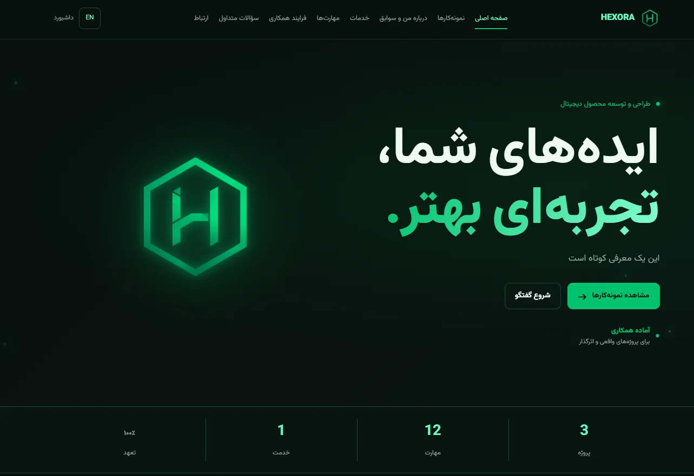

</details>

<details>
<summary>Homepage project showcase</summary>

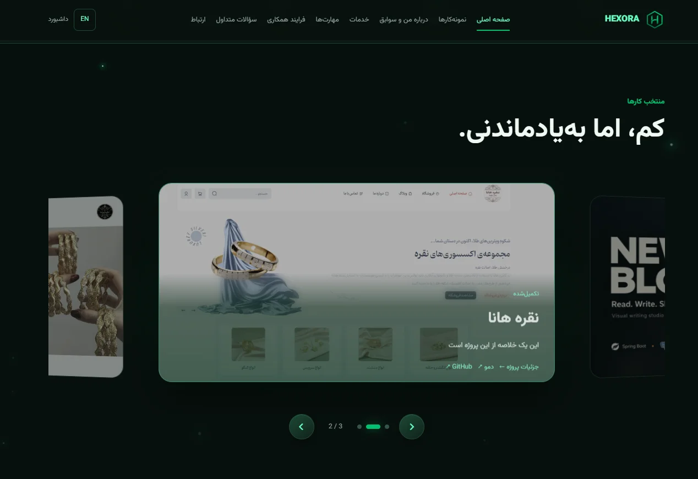

</details>

<details>
<summary>Homepage skills</summary>

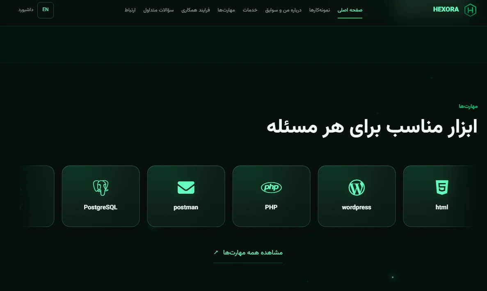

</details>

<details>
<summary>Client testimonials</summary>

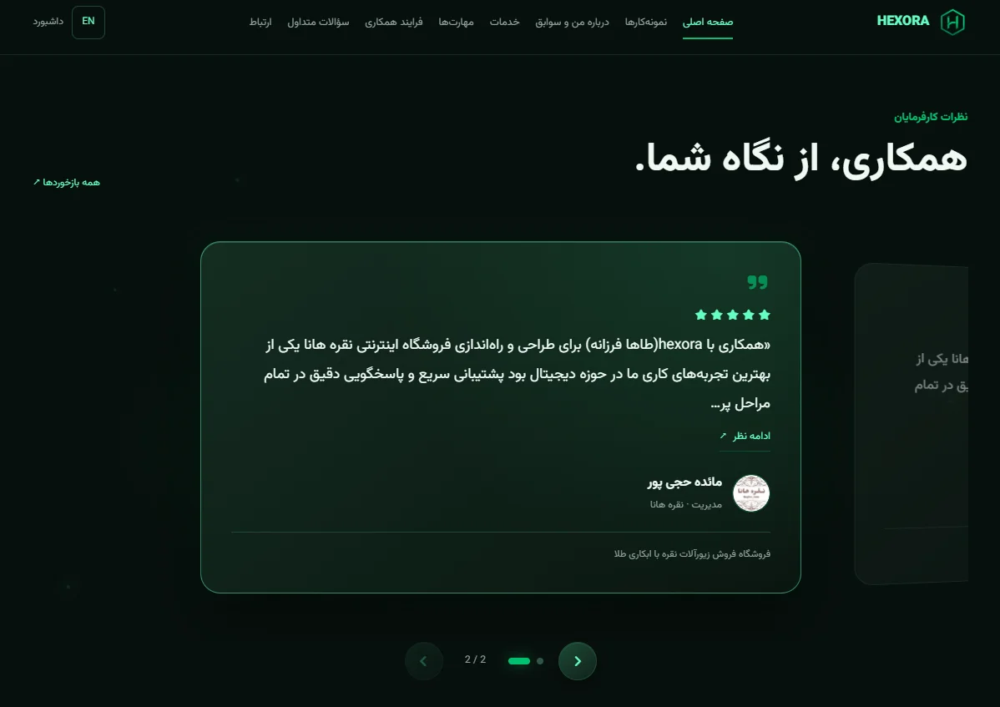

</details>

<details>
<summary>Skills by category</summary>

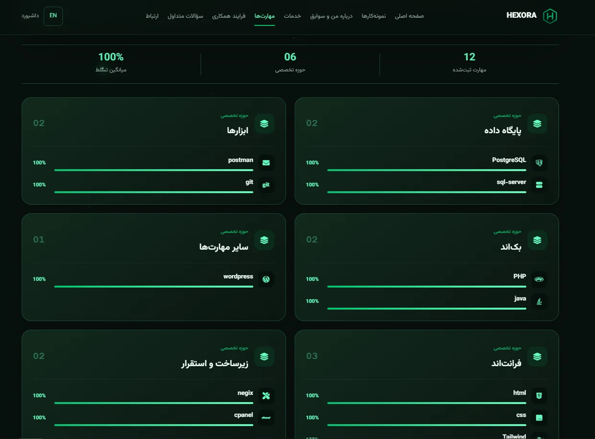

</details>

<details>
<summary>Contact and private conversation</summary>

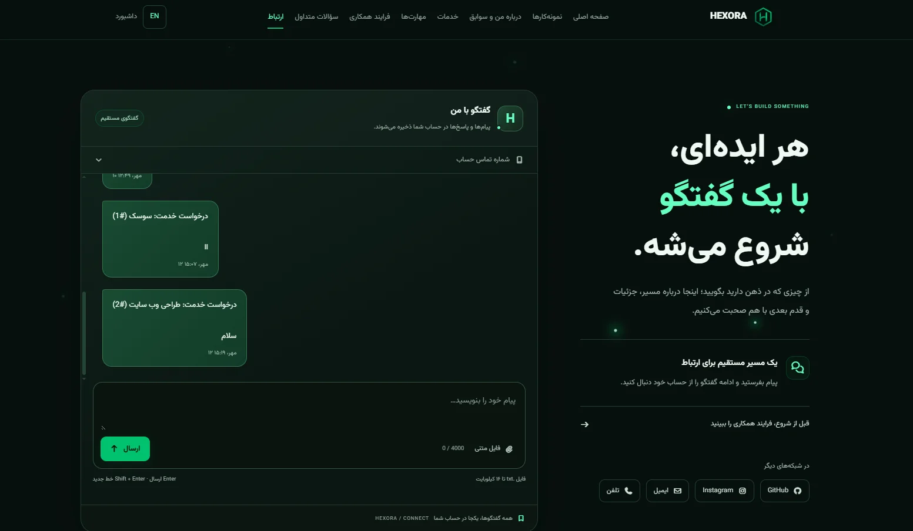

</details>

### Administration

<details>
<summary>Admin dashboard</summary>

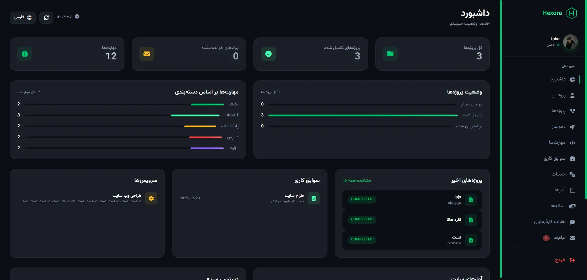

</details>

<details>
<summary>Demo studio</summary>

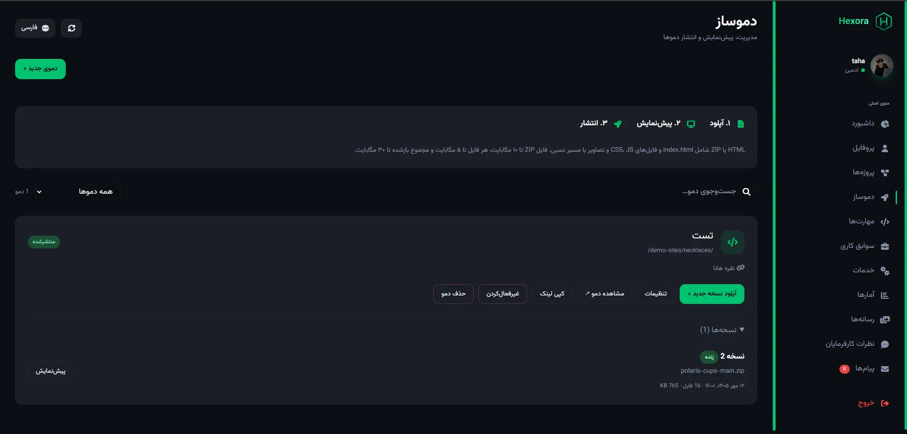

</details>

<details>
<summary>Media library</summary>

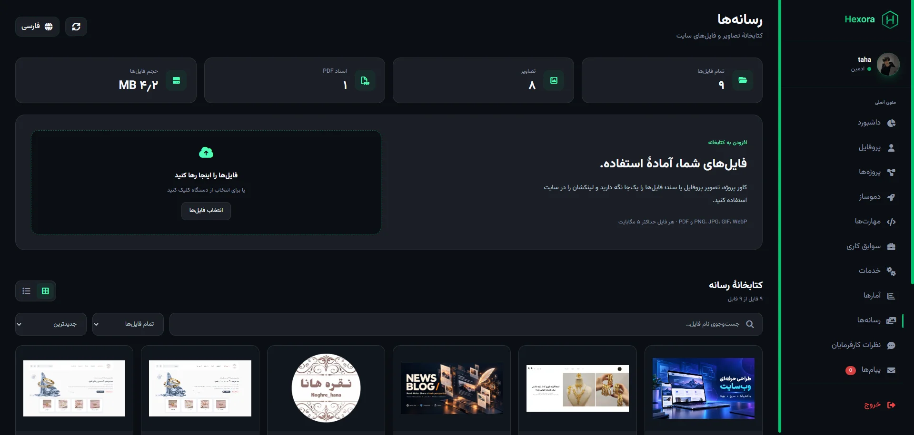

</details>

<details>
<summary>Admin conversations</summary>

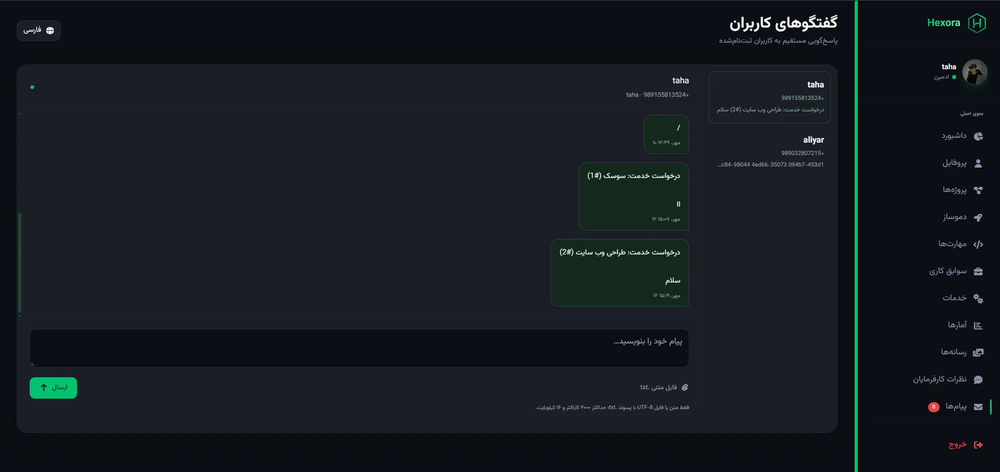

</details>

## Project overview

<p align="center">

</p>

The header and infographic are generated presentation artwork. The interface illustrations are **conceptual visuals, not screenshots** of the running application. [Artwork prompts](docs/image-prompts.md) document the visual brief.

## Architecture

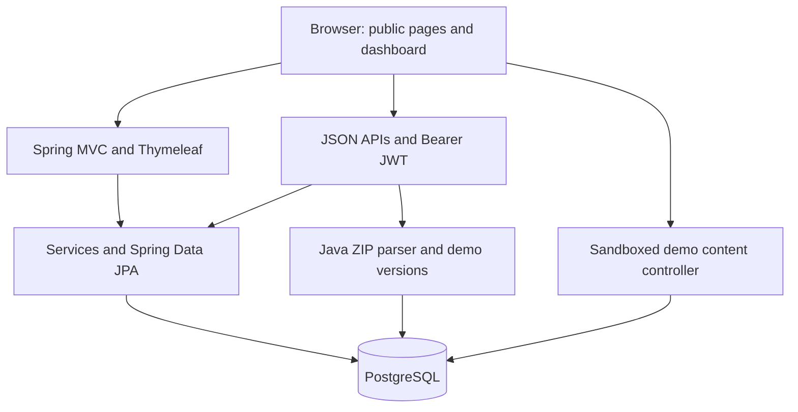

| Layer | Technology |
| --- | --- |
| Runtime | Java 17, Maven Wrapper |
| Application | Spring Boot 4.1.1, Spring MVC |
| Views | Thymeleaf, HTML, CSS and JavaScript; Tailwind in dashboard templates |
| Authentication | Spring Security, signed Bearer JWT, `USER` / `ADMIN` roles |
| Persistence | Spring Data JPA / Hibernate, PostgreSQL |
| Icons | Font Awesome with a searchable catalog |
| Demo serving | Java ZIP parsing, versioned PostgreSQL assets, HTTP MIME responses and CSP sandbox |
| Operations | Actuator health endpoint, environment-based configuration |
| Validation tools | Node.js renderer checks, Java archive checks, Python API tests and Playwright/Chromium browser checks |

**PostgreSQL is the only database configured by the application.** Authentication is stateless: APIs receive `Authorization: Bearer <token>`, and the application does not use a login session ID. Browser code stores the access token in local storage. The configurable token lifetime defaults to 900 seconds; logout clears the browser credentials, rather than revoking an already issued token on the server.

## Quick start

### Prerequisites

**The application runtime uses Java and PostgreSQL. Python and Node.js are used for repository tests; they are not required to run the Spring Boot application.**

- Java 17 and a running PostgreSQL database.
- Network access to Maven repositories for the first dependency download.
- Git; the repository includes the Maven Wrapper.

### 1. Clone and prepare the database

```bash
git clone https://github.com/Tahanoa/hexora-beta.git
cd hexora-beta
```

Create a PostgreSQL database with your preferred database tool:

```sql
CREATE DATABASE hexora;
```

### 2. Configure the application

In Bash / Git Bash:

```bash
export DATABASE_URL='jdbc:postgresql://localhost:5432/hexora'
export DATABASE_USERNAME='postgres'
export DATABASE_PASSWORD='your-database-password'
export JWT_SECRET="$(openssl rand -base64 32)"
export ADMIN_USERNAME='hexora-admin'
export ADMIN_EMAIL='admin@example.com'
export ADMIN_PASSWORD='choose-a-strong-admin-password'
```

Use **`openssl rand -base64 32`**, including the `openssl` command. Keep the generated JWT secret in your environment configuration for subsequent runs; changing it invalidates existing tokens. If OpenSSL is unavailable, generate a Base64-encoded random key of at least 32 bytes with another trusted tool.

The `ADMIN_*` variables create an administrator when all three are provided and that username does not already exist. They do not change the password of an existing account. Use your actual email and unique credentials.

### 3. Run

```bash
./mvnw spring-boot:run
```

On Windows Command Prompt or PowerShell, set the equivalent environment variables and run:

```powershell
.\mvnw.cmd spring-boot:run
```

Open **http://localhost:8080/**, sign in at `/login`, and manage content at `/dashboard`. Normal login returns to the root homepage; a pending service request returns to its contact flow. `/home` redirects to `/`.

The current development configuration uses `JPA_DDL_AUTO=update` to create or update entity tables, including chat messages, testimonials, service collection tables and demo/version/asset tables. Flyway dependencies and its location setting are present, but this repository currently contains **no versioned migration scripts**. Do not assume an existing production migration workflow.

### Configuration reference

| Variable | Purpose | Default / behavior |
| --- | --- | --- |
| `DATABASE_URL` | PostgreSQL JDBC URL | Local `postgres` database in the development configuration |
| `DATABASE_USERNAME` / `DATABASE_PASSWORD` | Database credentials | Explicit values recommended |
| `JWT_SECRET` | JWT signing key | Required; decoded key must contain at least 32 bytes |
| `JWT_ACCESS_TOKEN_TTL` | Access-token lifetime, seconds | `900` |
| `ADMIN_USERNAME` / `ADMIN_EMAIL` / `ADMIN_PASSWORD` | Initial administrator | No administrator is bootstrapped without all three |
| `REGISTRATION_ENABLED` | Permit new account registration | `true` in development; `false` in the `prod` profile unless enabled |
| `JPA_DDL_AUTO` | Hibernate schema behavior | `update` |
| `PORT` | HTTP port | `8080` |
| `JPA_SHOW_SQL` | SQL logging | `false` |
| `DEMO_PUBLIC_BASE_URL` | Optional dedicated demo origin, e.g. `https://demo.example.com` | Empty: URLs use the current app host; origin only, without a path |
| `DEMO_PANEL_ORIGIN` | Portfolio origin allowed to embed previews from the demo domain | Empty: same-origin embedding; origin only, without a path |

For the `prod` profile, provide the required database variables and signing key. Set `REGISTRATION_ENABLED=true` if visitors should be able to create accounts for chat. Use HTTPS and establish a deliberate schema-management and backup process for your deployment.

## Routes

| Public route | Page |
| --- | --- |
| `/` | Homepage |
| `/projects` / `/projects/{slug}` | Work showcase / project detail |
| `/services` / `/services/{slug}` | Service catalog / service detail |
| `/skills` | Skills |
| `/about` | About and career; `/experience` redirects here |
| `/collaboration` | Collaboration process |
| `/faq` / `/testimonials` | Questions / published client feedback |
| `/contact` | Chat entry; authentication and a saved phone are required to send |
| `/login` / `/register` | Authentication |
| `/demo-sites/{slug}/…` | Static assets in the selected live demo version |
| `/demo-preview/{versionId}/{token}/…` | Temporary capability-scoped preview; expires after ten minutes |

| Dashboard route | Page |
| --- | --- |
| `/dashboard` / `/profile` | Overview / profile management |
| `/manage/projects` / `/manage/skills` / `/manage/services` | Portfolio management |
| `/manage/experience` / `/manage/statistics` | Career / statistics |
| `/manage/media` / `/manage/testimonials` | Media / client feedback |
| `/manage/demos` | Static demo studio |
| `/manage/contact` | Administrative chat |

Dashboard HTML shells are loadable routes; browser code checks the account and the backend enforces administrative access to protected APIs.

### API orientation

| API | Access / purpose |
| --- | --- |
| `/api/auth/register`, `/api/auth/login` | Public authentication entry points |
| `/api/auth/me`, `/api/auth/phone` | Authenticated account information / save phone |
| `/api/{profile,projects,skills,services,experience,statistics}/public…` | Public portfolio reads |
| `/api/testimonials/public` | Published feedback only |
| `/api/media/public/{id}` | Public portfolio file bytes |
| `/api/services/public/slug/{slug}` | Published service detail; drafts return 404 |
| `/api/demos` / `/api/demos/{id}` | ADMIN: list/create, update settings or delete a demo |
| `/api/demos/{id}/versions` | ADMIN: multipart HTML/ZIP upload (`file`, optional `label`) |
| `/api/demos/{id}/publish` | ADMIN: publish/restore the supplied `versionId` |
| `/api/demos/{id}/deactivate` | ADMIN: disable public access and unlink the managed project URL |
| `/api/demos/{id}/versions/{versionId}/preview` | ADMIN: issue a scoped temporary preview URL |
| `/api/demos/{id}/versions/{versionId}` | ADMIN: delete an unused version |
| `/api/chat/messages`, `/api/chat/files` | Own thread and text attachments; authentication required |
| `/api/chat/admin/…` | Administrative conversation management |
| Other portfolio management `/api/…` routes | `ADMIN` access |

See the controllers under `src/main/java/dev/hexora/controller` and `security/AuthController.java` for exact methods, request fields and response shapes. The old anonymous contact-form POST is removed; its legacy records are retained.

## Repository map

```text
src/main/java/dev/hexora/
  controller/       HTTP routes and APIs
  dto/              Request and response contracts
  model/            Persistent entities
  repository/       Data access
  security/         Authentication and JWT
  service/          Application behavior
src/main/resources/
  templates/home/   Public portfolio and chat views
  templates/dashboard/  Shared dashboard and administration
  templates/error/  Custom 404
  static/           CSS, JavaScript, fonts, icons and brand assets
scripts/            Java, Node.js, Python and browser validation scripts
.github/workflows/  Build and integration/browser checks
docs/assets/        README presentation artwork
```

## Database compatibility

The current configuration uses `JPA_DDL_AUTO=update`. Services add nullable fields and ordered collection tables: `service_deliverables`, `service_relatedprojectids` and `service_faqs`. Demo storage adds `demo_sites`, `demo_versions` and `demo_assets`. Existing service content is preserved; draft/public compatibility is described in [Services](#services).

Flyway dependencies are present, but there are no versioned migration scripts or a new Flyway baseline in this repository. Environments using `validate` or a managed production migration process must apply equivalent schema changes before starting this version. Back up existing data before a production upgrade.

## Validation

[The latest feature validation run](https://github.com/Tahanoa/hexora-beta/actions/runs/37202091298) for commit `832a301` passed the Maven build, application startup, PostgreSQL integration checks and Chromium browser checks. These results cover the features described here; they do not represent a complete security audit.

| Check | Coverage |
| --- | --- |
| `scripts/check-service-renderer.cjs` | Covers/icons, deliverables, links, legacy features, English labels and escaped output |
| `scripts/DemoBundleCheck.java` | HTML, ZIP assets, enclosing-folder removal, UTF-8, traversal rejection and size/count limits |
| `scripts/check-services-api.py` | Service CRUD, media, draft privacy, publishing, related work, FAQs and service-aware chat |
| `scripts/check-demos-api.py` | Private drafts, scoped previews, MIME/security headers, publication, asset paths, project links, rollback, deactivation and invalid archives |
| `scripts/check-demos-browser.cjs` | Admin create/upload/preview/publish/deactivate flow, mobile overflow, blocked panel DOM/storage access, ZIP CSS and ES modules with nested imports |

The two Python scripts are test utilities, which contribute to GitHub's language statistics. ZIP parsing, storage and demo serving are implemented in Java. The browser test also uses Python's standard library to create a temporary ZIP fixture.

### Run checks

Renderer and archive checks require Node.js and a Java 17 JDK:

```bash
node scripts/check-service-renderer.cjs
javac -d /tmp/demo-parser src/main/java/dev/hexora/service/DemoBundle.java scripts/DemoBundleCheck.java
java -cp /tmp/demo-parser DemoBundleCheck
./mvnw -B -DskipTests package
```

API checks require Python 3 and a running app connected to a **disposable PostgreSQL database**. Configure `ADMIN_USERNAME`, `ADMIN_PASSWORD` and optionally `HEXORA_TEST_BASE_URL` (default `http://127.0.0.1:8080`). Registration must be enabled for the service request checks.

```bash
python3 scripts/check-services-api.py
python3 scripts/check-demos-api.py
```

The checks create temporary records. They clean up created services, demos, projects and media; the service test leaves its test user/conversation in the disposable database.

For browser checks, also install Playwright and Chromium; Node.js 22 is used in CI:

```bash
npm install --prefix /tmp/hexora-browser --no-save --ignore-scripts playwright@1.62.1
node /tmp/hexora-browser/node_modules/playwright/cli.js install chromium --with-deps
NODE_PATH=/tmp/hexora-browser/node_modules node scripts/check-demos-browser.cjs
```

GitHub Actions runs these checks automatically on pushes to `main` and pull requests, using PostgreSQL 16 and a disposable application instance. The scripts need test credentials in the environment; use a separate test instance rather than production.

## Project status

Hexora is a **beta application under active development**. The services catalog, service requests and static demo studio are implemented and covered by the successful CI run linked above. Local builds still require Maven repository access; a restricted local network can block dependency downloads even when CI succeeds.

If a build reports an unresolved parent POM or dependency download error, check Maven repository access before changing application code. If startup reports a missing JWT secret, configure `JWT_SECRET`. If chat sending is disabled, sign in and save a phone number. If a ZIP fails to upload, check its entry page, relative asset paths, supported static extensions and size limits. Browser storage-dependent demos and server-side applications need a different hosting approach.

---

Built by [Tahanoa](https://github.com/Tahanoa) · [Hexora repository](https://github.com/Tahanoa/hexora-beta)
